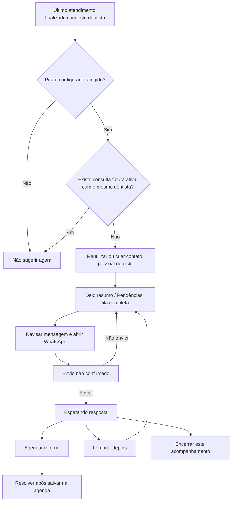

# R-161e — Reativação pessoal no Dex

> **SPEC** · **R-161e** · ⏳ fila
> **Aberto:** 2026-09-15 · **Fechado:** — · **Fase:** adiada por Mateus no recorte final de 15/09
> Regras pessoais preservadas para o próximo lote. Não incluir R161e nesta publicação.
> Rascunho técnico não aplicado preservado fora da árvore executável, em diretório privado de testes.

## 1. Problema e situação encontrada

Dentista sem secretária precisa identificar quem deixou de retornar e conduzir o contato sozinho.
O acesso deve caber na rotina de atendimento, sem exigir navegação por gestão de clínica.

Base conferida no candidato `/home/mtx/.local/share/odontoia-testes/worktree`:
- R161d já contém Kanban, modelos por profissional, histórico, adiamento, agendamento e WhatsApp manual.
- `src/server/pendencias/{contracts,operations}.ts` centraliza contratos e operações reutilizáveis.
- O reconciliador R161d escolhe a última visita finalizada do paciente na clínica e corta em 30 dias.
  Também exclui consulta futura com QUALQUER profissional: duas regras precisam mudar neste recorte.
- `src/lib/dex/retencao.ts` usa outra classificação, baseada em fichas/agenda, com 30/60 dias.
  `src/hooks/useDexHub.ts` consome `/api/dex/retencao` e mantém cache de 120 segundos.
- O Dex pode sugerir contato sem conhecer o encerramento/adiamento do Kanban. Não criar uma terceira fila.
- Pendências está no candidato/piloto Free; implementação existente não equivale a release integrado verificado.

## 2. Decisões e alternativas

**Confirmado por Mateus em 15/09:**
1. Padrão de 30 dias, configurável; permitir 60, 90 e 180 dias e desativação por dentista.
2. Cada dentista acompanha os próprios atendimentos do paciente.
3. Consulta futura com OUTRO dentista não suspende o acompanhamento pessoal.
4. WhatsApp continua manual, sem API/disparo em lote. Planejamento vem antes do código.

**Proposta para conferência:** resumo expansível no Dex e fila completa em Pendências.
O card substitui a área central “O mês”; métricas continuam nos destinos atuais de resultados.
Evita duplicar o Kanban e preserva espaço para as pendências operacionais mais urgentes.
Configurar mensagens/prazo em Pendências → Mensagens e regras, com atalho no card do Dex.
Não adicionar uma aba de configuração ao Consultório só para esta função.

## 3. Experiência e fluxo

Dex → **Reativar pacientes** → expandir até 3 contatos → revisar mensagem → abrir WhatsApp.
**Ver todos** abre `/pendencias?tipo=reativar_paciente`; cada linha abre o mesmo contato, pelo ID.
Dentista trabalha normalmente sem secretária. Havendo equipe autorizada, pode delegar a mesma pendência.

Card fechado: “8 a contatar · 2 esperando resposta”. Contagens do próprio dentista e clínica ativa.
Expandido: nome, tempo desde SEU último atendimento, situação e ação principal.
Sem estimativa de receita, diagnóstico inferido ou número de telefone exposto no resumo.
Ordem: adiamentos que venceram primeiro; depois elegibilidade mais antiga; desempate por ID.
Deixar claro quem está executando o contato quando houver delegação.



“Envio não confirmado” é indicação dentro da coluna Esperando resposta, como em R161d;
não acrescentar uma quarta coluna. Abrir conversa nunca confirma envio nem presença.
Mensagens continuam editáveis antes de abrir; editar um envio não muda o modelo do dentista.

## 4. Contrato técnico proposto

### Fonte, regras e persistência

Reusar `pendencias_contatos`, `pendencias_mensagens` e `pendencias_contatos_historico`.
Elegibilidade por `(clinica_id, paciente_id, dentista_id)`, com último
`atendimentos_clinicos.estado='finalizado'` desse trio; desempate data_atendimento/ID.
Dias pelo calendário America/Sao_Paulo; nunca por data de cadastro ou falta/cancelamento.
Agenda futura exclui apenas o mesmo trio, com status scheduled/confirmed/checked_in/in_progress.
Reativação não exige consulta futura: é justamente uma sugestão para organizar o contato.

Manter unicidade atual por clínica/tipo/paciente/dentista/origem_versao (ID do atendimento).
Reconciliar novo atendimento/retorno também pelo dentista, inclusive em contatos já abertos.
Visita de B não encerra nem reinicia o ciclo de A. Não substituir IDs/históricos existentes.
Encerrar não recria aquele ciclo; nova visita finalizada do mesmo dentista permite ciclo novo.
Adiar conserva ID e só volta na data escolhida; outro dentista não altera esse adiamento.

Adicionar a `pendencias_mensagens` campo **novo proposto** `reativacao_dias smallint NULL`:
CHECK NULL ou 30/60/90/180; NULL equivale ao padrão de 30 para reativação.
Confirmação de presença não usa esse campo. `ativo`/`template`/`versao` existentes são reaproveitados.
RPC/modelo/schema aceitam o campo opcional; cliente antigo que o omitir preserva o valor salvo.
Desativar não apaga contatos: bloqueia nova abertura, mantém histórico e conclusão dos já enviados.
Aumentar prazo retira da fila ativa os ainda não iniciados; esperar resposta não desaparece.
Diminuir prazo considera ciclos elegíveis sem reabrir os encerrados.

### Resumo e navegação

Propor `listarResumoReativacao` em `src/server/pendencias/operations.ts`, retornando
`PendenciasResult<ResumoReativacao>`; nova RPC `resumir_reativacao_contatos` reutiliza
as mesmas regras/autorização/reconciliação. Contar no banco; não usar o limite de 500 do board como total.

```ts
type PrazoReativacao = 30 | 60 | 90 | 180;
interface ResumoReativacao {
  clinicaId: string;
  dentistaId: string;
  ativo: boolean;
  prazoDias: PrazoReativacao;
  aContatar: number;
  esperandoResposta: number;
  pacientes: { id: string; pacienteNome: string; ultimaVisitaEm: string; status: 'a_contatar' | 'esperando_resposta' }[]; // máximo 3; abrir contato existente pela URL
  atualizadoEm: string;
}
```

Fronteira valida UUIDs, contagens inteiras não negativas, enum e até 3 cards em Zod.
DentistaId deriva do contexto autenticado; não aceitar ID de colega como escopo pessoal.
Entrada inclui `clinicaIdEsperada`; preservar códigos de erro R161d, sem transformar erro em zero.
Nova Server Action fina de resumo; não criar endpoint público de histórico clínico.
Abrir/operar contato usa `operarContato` existente, com `versaoEsperada`, sem ação paralela no Dex.
Extrair o modal/controle de contato reutilizável de `PendenciasWorkspace`, preservando contrato visual R161d.
URL aceita `tipo` conhecido e `contato` UUID, carrega o contato autorizado e aplica filtro na abertura.
Nenhuma query string concede acesso, muda status ou abre WhatsApp automaticamente.

No piloto, substituir a fonte de “parou de vir” do Dex pela fonte canônica.
Não mostrar simultaneamente o card antigo e o novo. Retenção de faltas/cancelamentos permanece
no recorte legado e não recebe novas ações de reativação silenciosamente.
Remover duplicação no badge: o card agregado conta uma pendência, não soma os pacientes de novo.
Carregar resumo só quando Dex abre; refresh ao reabrir, voltar do WhatsApp ou concluir operação.
Cache isolado por usuário/clínica/dentista, invalidado em troca de contexto; sem polling contínuo.
Falha apenas em reativação não deve apagar agenda, alertas ou outras áreas do Dex.

### Acessos e delegação

Dentista individual/colaborativo/agregado: apenas seu acompanhamento na clínica ativa.
Dentista proprietário: Dex pessoal; cargo não muda o escopo para todos os colegas.
Secretária: fila dos profissionais concedidos. Proprietário não clínico/protético não ganham Dex clínico.
Reusar pacientes.ler, acompanhamentos.ler/gerir, contatos.whatsapp e agenda.editar no alvo.
Negação no servidor e RLS, inclusive em endereço direto, telefone, modelos, totais e operações.

Delegação é lote próprio: altera `responsavel_usuario_id`, preserva dentista/origem e registra evento.
Exige gerir a pendência e destinatário ativo já autorizado a ler e operar aquele alvo na mesma clínica.
Não cria grants, perfil clínico ou segunda pendência. Sem destinatário válido, contato fica com dentista.
O dentista de origem mantém leitura/retomada autorizada do SEU acompanhamento após delegar:
ajustar o check específico de Pendências, sem redefinir globalmente o significado de escopo próprio.
Adicionar ação `delegar` e histórico correspondente com versão esperada; conflito não sobrescreve outro ator.
Equipe e dentista compartilham versão/histórico da mesma pendência. Dois dentistas têm ciclos próprios:
não fundir ou bloquear o contato de A porque B abordou o paciente; não expor detalhes de B a A.

## 5. Estados e exemplos de aceite funcional

| Situação | Resultado esperado |
|---|---|
| Última visita com A há 29 dias; prazo 30 | Não entra. |
| Última visita com A há 30 dias; sem agenda futura com A | Entra uma vez para A. |
| A há 45 dias, B ontem | A continua elegível; B aguarda seu prazo. |
| A há 45 dias; consulta futura com B | A continua elegível. |
| Consulta futura ativa com A | A sai da reativação; confirmação segue R161d na véspera. |
| Nunca foi atendido, só faltou | Não entra neste tipo de reativação. |
| Modelo desativado | Sem novas aberturas; histórico/contatos enviados preservados. |
| Sem telefone válido | Indicar cadastro pendente; editar só se autorizado, sem link inválido. |
| Abrir WhatsApp, depois Não enviei | Volta a contatar, sem envio/presença inventados. |
| Retorno salvo em outra tela | Reconciliar mesma origem; não pedir segundo agendamento. |
| Agendamento falha ou modal é abandonado | Contato não resolvido; nenhum horário fictício. |
| Resposta se perde depois de salvar | Recarregar origem/histórico antes de repetir; sem duplicação. |
| Duas pessoas operam a mesma versão | Uma grava; outra recebe conflito e atualiza. |
| Troca de clínica durante edição | Limpar dados antigos e negar ação com contexto anterior. |
| Sem permissão / contato indisponível | Erro específico sem revelar nome/telefone/dados de colega. |
| Carregando / erro de rede / vazio real | Skeleton / tentar novamente / nenhum paciente elegível, distintos. |

## 6. Referência visual e aprovação

Base: `src/components/layout/dex-hub/dex-hub-modal.tsx`, Dashboard, Meu Dia e Ficha.
Preservar dock inferior, header do Dex, atalhos clínicos e visual do Kanban aprovado R161d.
**Próximo artefato proposto:** `plans/artefatos/R-161e-reativacao-pessoal-dex.html` (ainda não criado).
Antes de código UI: brief → extração DOM de tokens reais → artefato desktop/mobile/light/dark → aceite.
Não copiar cores/medidas inadequadas só porque estão no código legado; tokens canônicos e contraste verificado.
Card expansível via teclado, foco visível, nomes legíveis, controles ≥44px, reduced-motion.
Mobile empilha o resumo sem comprimir as três colunas do Dex; decisão geométrica depende do artefato.
Não mudar visualmente todas as áreas do Dex junto deste recorte.

## 7. Invariantes

- Fila e resumo refletem o mesmo ID, estado e regra pessoal; nenhuma lista independente no navegador.
- Atendimento/retorno de colega não suprime o acompanhamento pessoal aprovado por Mateus.
- Reativação sugere contato, nunca necessidade clínica nem tratamento específico.
- Abrir link ≠ mensagem enviada ≠ retorno agendado; cada fato exige sua ação/evidência.
- Nenhum dado, histórico, orçamento ou receita é apagado/recalculado por esta função.
- Nenhuma alteração/fixture em produção durante construção e QA; Free etlqznuoxiilvxzygpat somente.

## 8. Ordem de implementação e gates

| Lote | Entrega | Condição para avançar |
|---|---|---|
| 0 | Conferir este contrato e desenho do fluxo | Decisões pessoais acima mantidas; plano conferido por Mateus. |
| 1 | Reconciliar candidato com main atual em checkout preservado; inventariar impacto R161d/R169 | Sem sobrescrever outras frentes; lista exata de arquivos/migrations e regressões. |
| 2 | Brief + artefato do card e configuração de prazo | Aceite visual antes dos componentes. |
| 3 | Elegibilidade pessoal + prazo/modelos + reconciliação | Testes 29/30/60/90/180 dias, A/B, futuros por profissional e ciclos sem duplicação. |
| 4 | Resumo autorizado + integração Dex/Pendências | Mesmo contato e contagens exatas, sem truncamento em 500, erro separado de vazio. |
| 5 | Ações manuais/agenda e delegação opcional | Sem secretária funciona; com equipe autorizada preserva origem/versão e histórico. |
| 6 | Auditoria técnica/UX, QA completo Free e Preview integrado | Duas contas logadas e duas clínicas; mobile/light/dark; roteiro abaixo aprovado. |
| 7 | Conferência de Mateus e preparação de publicação | Só depois commit/push/release autorizado; migrations compatíveis separadas do app. |

Gates obrigatórios, todos pendentes (este documento não executa testes):
- AC01: matriz temporal e exemplos §5 — unitários determinísticos + RPC autenticada Free.
- AC02: A e B atendem o mesmo paciente; consulta futura/visita de B não retira A — duas sessões.
- AC03: dentista sozinho faz abrir/enviei/adiar/encerrar/agendar — browser integrado e histórico.
- AC04: secretária autorizada opera contato delegado; revogada não opera — duas sessões + URL direta/RPC.
- AC05: clínica A não lê/opera clínica B; troca durante requisição não vaza estado — duas contas logadas.
- AC06: repetição, concorrência e perda de resposta — simulação controlada no Free; verificar fatos persistidos.
- AC07: modelo/prazo de A não muda B; cliente antigo preserva novo campo — testes de contrato e compatibilidade.
- AC08: todas as linhas §5 vistas em UI; erros não mostram sucesso/zero — navegador, teclado e mobile.
- AC09: resumo e board concordam após ação, retorno do WhatsApp e contexto — teste integrado.
- AC10: 500+ contatos sintéticos não truncam o total do resumo; payload de até 3 cards — fixture Free isolada.
- AC11: confirmação de amanhã, Meu Dia, agenda/retorno, Dex clínico e navegação permanecem — regressão Preview.
- AC12: SQL sem DML destrutivo; rollout/rollback conferidos — review antes de migração.

PC limitado: unitários/harness leves auxiliam; build/Next completo vai ao Preview apropriado.
Harness não substitui Server Actions/cookies/rotas no app integrado. QA abre janela simulada, sem mensagem real.
Revisores/agentes só na etapa de execução combinada; nenhuma nova equipe de execução foi acionada neste plano.

Publicação: snapshot/backup verificável antes do schema oficial; migration aditiva primeiro,
objetos/grants conferidos diretamente no schema, depois app compatível e liberação pequena.
Migração não copia pacientes de teste para produção. Se falhar: desligar entrada do recurso,
voltar app compatível e preservar contatos/histórico; não dropar tabelas nem restaurar dados às cegas.

## 9. Fora de escopo

API WhatsApp, envio automático/em lote, resposta interpretada por IA, mensagens clínicas geradas,
cobrança atrasada, negociação/orçamento comercial novo, acompanhamento pós-operatório, kits,
cartão parcelado R163b e remodelação dos perfis de proprietário. Esses recortes têm contratos próprios.
O recorte pessoal não reabre os projetos clínicos congelados nem autoriza deploy da atualização inteira.
